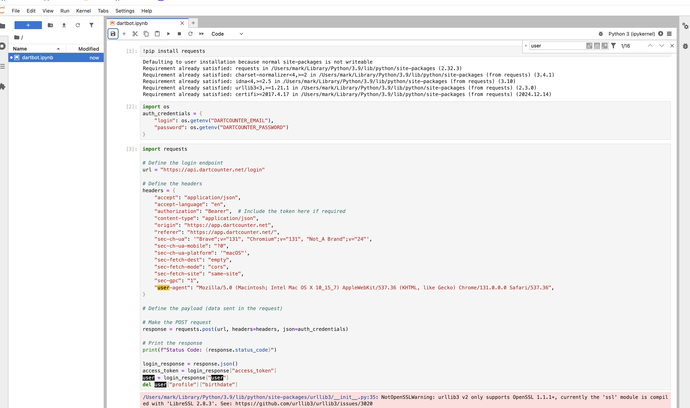
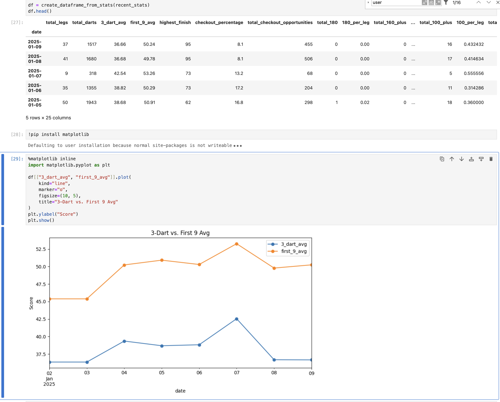

# DartCounter API

I like tracking progress against improving my darts.
The DartCounter app is awesome for inputting scores, even better with the Omni auto scoring system.

The client app shows all statistics, but doesn't show my exactly what I want, to answer the question,

**"Am I improving?"**

Throwing thousands of darts over hundreds of legs, it's hard to get a hollistic factual understanding of if you're improving, and analysing that would take a long time.

Thankfully they have an [OpenAPI spec](https://api.dartcounter.net/docs/api-docs.json) where I could see how to use the API. I combined this with information from my browser by visiting their [web app](https://app.dartcounter.net/).

I created a jupyter notebook to pull the relevant information from their API, analyse it, aggregate it at a day level, and see if I'm getting better, day by day.

## How can I run this?

1. Install python 3, I used 3.9
1. [Install jupyterlab ](https://jupyterlab.readthedocs.io/en/latest/getting_started/installation.html), I just used pip
1. Set environment variables for your email and password:
```bash
export DARTCOUNTER_EMAIL=<your-email-here@mail.com>
export DARTCOUNTER_PASSWORD=<REDACTED>
```
1. Run this: `python3 -m jupyterlab` in this directory

You should see this:


Run each of the cells in turn to see how the information is fetched, analysed, combined, and plotted:


